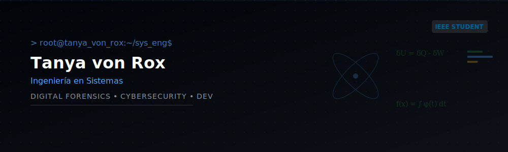

  

 

## 👩‍💻 About my technical profile

I am a Systems Engineering student and an active **IEEE** member, deeply involved in the **Computer Society** and **IAS (Industry Applications Society)**. My focus lies at the convergence of network infrastructure, software development, and cybersecurity. I enjoy building robust solutions and understanding the mathematics and electronics behind complex systems.

🎓 **Core Focus Areas:** Cybersecurity, Software Development, Telecommunications Engineering, and Electronics.
🧩 **Research Interests:** Applied Mathematics, Statistics, Programmable Logic Controllers (PLC), and Industrial Automation.

---

## 🛠️ Tech Stack & Skills

### 💻 Frontend & Web

  
  
  
  
  

### ⚙️ Backend, Python & Data

  
  
  
  
  

### 🗄️ Databases

  
  
  
  

### 🛡️ Cybersecurity & Infrastructure (DevOps)

  
  
  
  
  
  
  
  

### 🤖 Automation & Workflow

  
  

### 🦾 Artificial Intelligence (LLMs)

  
  
  

### ⚡ Engineering, Sciences & Certifications

  
  
  
  
  
  

---

 

  
<i>"You are the net. The net is you."</i>

  
<b>– Lain Iwakura</b>

